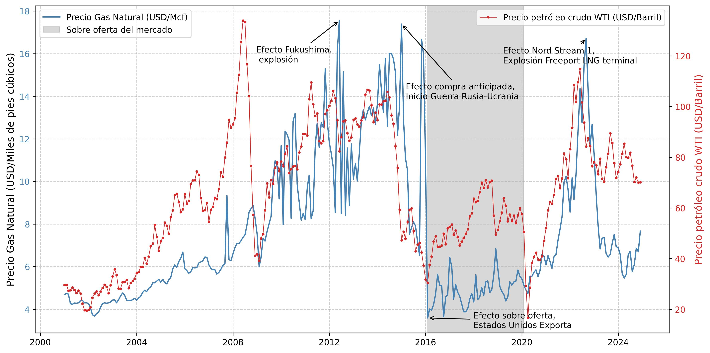
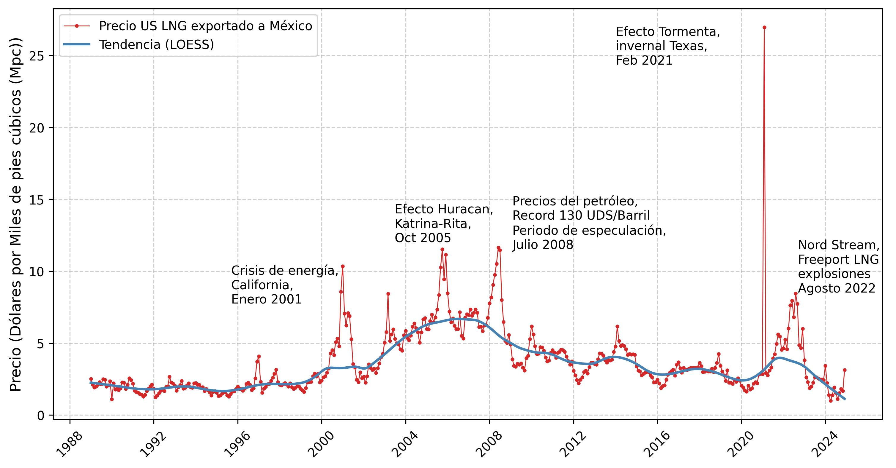

#### El impulso para la comercialización global del gas natural se ha hecho bajo el amparo de la narrativa de la transición energética.

### Definición:
> <mark>**La transición energética global**, entendida como el proceso en el que las sociedades a escala mundial llevan a cabo estrategias para reducir el uso de combustibles de alto impacto ambiental (Naciones Unidas, 2023.)

### Contraste de emisiones Carbón vs. Gas Natural. 

*Fuente: Allen, 2014; Lu et al., 2023)**
### México:  Un país dependiente de la energía proveniente de Estados Unidos.

**Figura 3**. Exportaciones mensuales de gas natural por gasoducto desde EE. UU. a Canadá y México (1973-2023)

 
Fuente Elaboración propia con datos de (Energy Information Agency, 2025). 

**Figura 4.** Precio de exportación Gas Natural Licuado (US dólar por miles de pies cúbicos) y precio de petróleo crudo, mezcla West Texas Intermediate (wti) 2001-2024

 

*Fuente: Elaboración propia con datos de (Energy Information Agency, 2025)*

**Figura 5.** Signos de la vulnerabilidad. Precio de exportación de gas natural licuado estadounidense a México 1989-2024

  
*Fuente: Elaboración propia con datos de (Energy Information Agency, 2025). Estimación local de tendencia loess por sus siglas en inglés)*
 

**Figura 7**. Representación de estados subyacentes. Exportaciones de gas natural a México desde Estados Unidos 1973-2025

  
*Fuente: Elaboración propia con datos de (Energy Information Agency, 2025)*

#### Dos estados subyacents identificados:

#### Pre-2010: Bajas importaciones, alineadas con políticas energéticas estatale. 

+ **1973-10-1 a noviembre 1 de 2010**  Fuerte rectoría del Estado previo a la reforma energética emprendida en la administración federal 2012-2018 en la cual se crearon importantes incentivos para la participación privada en el sector.

#### Post-2010: Aumento abrupto de importaciones, impulsado por la participación privada tras la reforma energética y la capacidad exportadora de EE. UU. 

+ El segundo estado subyacente identificado comprende de **noviembre de 2010 a diciembre de 2024**; este periodo registra un cambio estructural en la trayectoria de las importaciones hechas por México consistente con un **esquema de dependencia energética** que incrementa la vulnerabilidad de la económica local, principalmente a través del sector industrial, en particular por el **impacto sobre la capacidad de generación eléctrica**. 

### Indicadores Críticos

+	Declive del 42.6% en producción doméstica 2012-2022

+	Incremento del 24.1% en consumo 2012-2022

+	Dependencia de importaciones de EE.UU. superará 50% para 2030

+ 	48% de generación eléctrica usa gas natural

+	Solo 46.8% de gasoductos son propiedad del Estado

###  Expansión de Infraestructura 2018-2024 

+	3,050 km de nuevos gasoductos

+	48.9% en región noroeste

+	 Proyectos emblemáticos en Sonora

##  Consideraciones finales

Los hallazgos principales muestran que proyectos de infraestructura, como las terminales  Energía Costa Azul y Saguaro Energía, **priorizan rutas de exportación a Asia**, consolidando el papel de **México como corredor de tránsito para el gas estadounidense** en lugar de fortalecer la soberanía doméstica.  

El hecho de que estos proyectos sean realizados por **capital estadounidense** e impulsados por los productores de ese país, muestra que en la práctica la administración federal actual en México, de hecho, facilita la **privatización de rubros estratégicos** para el desarrollo del país, profundizando en el largo plazo, la dependencia que el país ya observa con su vecino del norte en materia energética. 

La evidencia estudiada sobre el reciente impulso por construir proyectos para exportación de gas natural en las costas del Pacífico mexicano y en los estados fronterizos como Sonora, Chihuahua y Baja California, **contrasta con la tendencia negativa al desarrollo de estos proyectos en la costa oeste del suelo estadounidense,**

En el caso de **México**, a pesar del discurso nacionalista observado en la administración actual sobre soberanía energética, en la práctica, las políticas en materia energética durante diversas administraciones **sugieren una profundización de la dependencia**, alineándose con **intereses estratégicos de EE. UU. mediante el impulso a proyectos de infraestructura transfronteriza en los que **la sustentabilidad ambiental no ocupa un papel activo.**

### Conclusión

Con base en las series estudiadas, podemos concluir que la trayectoria energética de México refleja dos hechos contrastantes: 

### Mientras el discurso oficial enfatiza la soberanía y la búsqueda de la autosuficiencia, la **dependencia estructural del gas estadounidense** se ha intensificado, especialmente en la última década. 

### Esta dependencia conlleva riesgos económicos por la volatilidad de precios y costos ambientales, tales como fragmentación de hábitats, disturbios en ecosistemas marinos y **contaminación por emisiones de metano.**

###  Gracias por su atención.  

## II Foro Adaptaciones locales al cambio climático
#####  El Colegio de la Frontera Norte
Diciembre 5, 2025.

jlmanzanaresrivera@colef.mx

  

---

<!-- Return to Home Page -->

  <a href="/" style="background-color: #2E86AB; color: white; border: none; padding: 10px 20px; border-radius: 5px; cursor: pointer; font-size: 14px; text-decoration: none; display: inline-block;">
    ← Return to Home
  </a>

