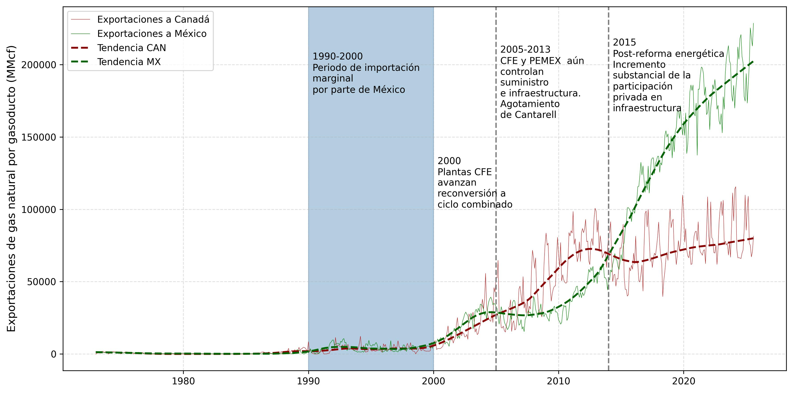

> **Punto de inflexión**: el desarrollo de la técnica de <mark>fracturación hidráulica en Estados Unidos<mark> que comienza 
con la reforma del **Energy Policy Act de 2005/Safe Drinking Water Act (SDWA)** como punto de inflexión.  

En el centro de la actual tendencia por el desarrollo de proyectos de infraestructura 
para el traslado de Gas Natural Licuado (LNG) en el noroeste de México tenemos el 
desarrollo de la técnica de fracturación hidráulica en Estados Unidos que comienza 
con la reforma **Energy Policy Act de 2005**  “Halliburton Loophole”

Esta reforma se impulsó durante la administración del presidente republicano de origen 
Texano George W. Bush, cuyos vínculos familiares con la industria petrolera son ampliamente documentados. 

Una iniciativa del vicepresidente Dick Cheney ex CEO de Halliburton , 
la empresa responsable de escalar comercialmente la técnica de fracturación hidráulica . 
Este hecho, ha significado la transformación del escenario geo-energético global 
impactando la región noroeste de México de manera crucial. 
La figura de Dick Cheney es un clásico ejemplo de riesgo moral y conflicto de intereses. 

 Ver [Uso de agua en la extracción de gas de lutitas en el noreste de México. Retos de regulación ambiental](https://dialnet.unirioja.es/servlet/articulo?codigo=5831993)

**Cuestionable ser juéz y parte**  (Participar financieramente en una industria que se pretende regular.)

## Estados Unidos. Líder productor mundial de LNG.

**Figura 1.** Producción gas natural. Principales países 1980-2024.

Fuente: Elaboración propia con datos de (Enerdata, 2025). 

Estados Unidos se ha convertido en el **líder productor mundial** y es proveedor de importantes socios  comerciales en Asia. 

### Japón, Corea del sur, Taiwán capturan **un tercio** de las importaciones mundiales. Potentes demandantes por su magnitud son China e India. 

**Figura 2**.  Gas natural en Estados Unidos. Balance entre producción, consumo interno y exportaciones 1950-2023.

Fuente Elaboración propia con datos de (Energy Information Agency, 2025). 

##### El **superávit** generado ha creado el incentivo económico de la **industria energética** estadounidense por desarrollar infraestructura con el propósito de transportar los excedentes desde los sitios de producción hasta los mercados destino, incluida la demanda de consumidores en Asía, lo que **implica contar con rutas eficientes en el océano Pacífico**.

La **desequilibrio geográfica** entre las zonas de **disponibilidad-extracción-exportación** y aquellas que impulsan los procesos de **demanda-importación-consumo**, ha resultado en el desarrollo de estrategias de abastecimiento que se materializan en proyectos de infraestructura trans regionales. 

## Mexico  transita de la autosuficiencia a la dependencia energética.

Add evalución historica de uso de gas natural para generación elecrtica. 


<iframe 
    src="/plots/fuentes_CFE.html" 
    width="100%" 
    height="650" 
    style="border:none;"
></iframe>


Fuente: Elaborción propia con datos de SENER  2025.

<!-- Return to Home Page -->

  <a href="/" style="background-color: #2E86AB; color: white; border: none; padding: 10px 20px; border-radius: 5px; cursor: pointer; font-size: 14px; text-decoration: none; display: inline-block;">
    ← Return to Home
  </a>

