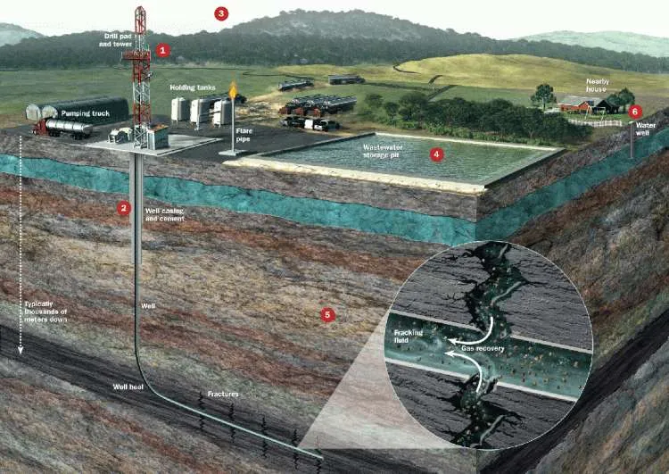

> **Punto de inflexión**: el desarrollo de la técnica de <mark>fracturación hidráulica en Estados Unidos<mark> que comienza 
con la reforma del **Energy Policy Act de 2005-safe Drinking Water Act (SDWA)** como punto de inflexión.  

En el centro de la actual tendencia por el desarrollo de proyectos de infraestructura 
para el traslado de Gas Natural Licuado (LNG) en el noroeste de México tenemos el 
desarrollo de la técnica de fracturación hidráulica en Estados Unidos que comienza 
con la reforma **Energy Policy Act de 2005**  “Halliburton Loophole”

Esta reforma se impulsó durante la administración del presidente republicano de origen 
Texano George W. Bush, cuyos vínculos familiares con la industria petrolera son ampliamente documentados. 

Una iniciativa del vicepresidente Dick Cheney ex CEO de Halliburton , 
la empresa responsable de escalar comercialmente la técnica de fracturación hidráulica . 
Este hecho, ha significado la transformación del escenario geo-energético global 
impactando la región noroeste de México de manera crucial. 
La figura de Dick Cheney es un clásico ejemplo de riesgo moral y conflicto de intereses. 

**Cuestionable ser juéz y parte**  (Participar financieramente en una industria que se pretende regular.)

<!-- Return to Home Page -->

  <a href="/" style="background-color: #2E86AB; color: white; border: none; padding: 10px 20px; border-radius: 5px; cursor: pointer; font-size: 14px; text-decoration: none; display: inline-block;">
    ← Return to Home
  </a>

