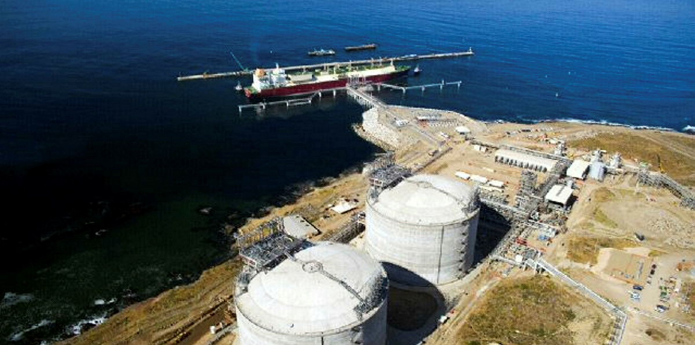

## Estados Unidos. Líder productor mundial de LNG.

**Figura 1.** Producción gas natural. Principales países 1980-2024.

Fuente: Elaboración propia con datos de (Enerdata, 2025). 

Estados Unidos se ha convertido en el **líder productor mundial** y es proveedor de importantes socios  comerciales en Asia. 

### Japón, Corea del sur, Taiwán capturan **un tercio** de las importaciones mundiales. Potentes demandantes por su magnitud son China e India. 

**Figura 2**.  Gas natural en Estados Unidos. Balance entre producción, consumo interno y exportaciones 1950-2023.

Fuente Elaboración propia con datos de (Energy Information Agency, 2025). 

##### El **superávit** generado ha creado el incentivo económico de la **industria energética** estadounidense por desarrollar infraestructura con el propósito de transportar los excedentes desde los sitios de producción hasta los mercados destino, incluida la demanda de consumidores en Asía, lo que **implica contar con rutas eficientes en el océano Pacífico**.

La **desequilibrio geográfica** entre las zonas de **disponibilidad-extracción-exportación** y aquellas que impulsan los procesos de **demanda-importación-consumo**, ha resultado en el desarrollo de estrategias de abastecimiento que se materializan en proyectos de infraestructura trans regionales. 

##  Proyectos actuales en desarrollo en Sonora y Baja California.  

## Terminales de licuefacción 

#### Terminal Saguaro Energía.

Localizadas en Puerto Libertad, Sonora: Costa del Golfo de California. (Estadounidense.Quantum Captal group via **Mexico Pacific**).

Se integra por una terminal que proyecta la exportación de 15 millones de toneladas por año (mtnpa) (Mexico Pacific Gas Bulletin Board, 2025).

#### La finalidad es abastecer la demanda externa de LNG generada en Asia mediante el envío por ruta marítima a través del Golfo de California. 

La terminal se ubica en una superficie de 600 hectáreas propiedad de la empresa México Pacific (Mexico Pacific Gas Bulletin Board, 2025), una compañía de capital estadounidense respaldada por la firma Quantum Captal group, consorcio dedicado a la inversión en sectores estratégicos como el energético. 

La planta Saguaro Energía forma parte del megaproyecto de transporte de gas natural desde Texas, Estados Unidos, en conjunto con el gasoducto Sierra Madre, ambos a cargo de la empresa de capital **extranjero Mexico Pacific.**

#### Terminal Energía Costa Azul 

 **Sempra Infraestructura** 

La terminal se localiza a 23 km al norte de la ciudad de Ensenada en el estado de Baja California. 

Este proyecto es relevante, ya que se trata de la primera planta de licuefacción en las costas del Pacífico mexicano con un inicio de operación previsto para 2026. En la escala regional, 

**Estados Unidos no cuenta con plantas de licuefacción en la costa del Pacífico.**  

Tradicionalmente, el flujo de gas natural de Estados Unidos se ha concentrado en los puertos del Golfo de México y la Costa Atlántica, debido a la cercanía con los sitios de extracción, por lo que **la construcción de este proyecto hace factible la exportación de los excedentes de ese país por la ruta del Pacífico.** 

##  Gasoductos: 

####	Samalayuca-Sásabe de 624 km. de longitud. 

Tiene una extensión de 624 km, un diámetro de 36 pulgadas y una capacidad de transporte de 472 millones de pies cúbicos diarios (mpcd) (Grupo Carso, 2024). El proyecto fue desarrollado por el sector privado a cargo de las empresas Carso Energy y fcc industrial (empresa de capital español).Ç. El proyecto conecta estratégicamente el gas proveniente de Estados Unidos con la red de distribución del Pacífico en el estado de Sonora. 

#### Sierra madre.

Longitud de 800 kilómetros: (Quantum-Mexico Pacific). Construcción a cargo de joint-venture entre GDI Sicim Pipelines y Bonatti.

Esta infraestructura de transporte de gas natural tiene una longitud proyectada de 800 km desde el municipio de Guadalupe en el estado de Chihuahua, hasta **Puerto Libertad, municipio de Pitiquito en Sonora**. 

Acorde con la documentación de **la empresa Mexico Pacific**, el ducto tiene una capacidad de transporte de 2.8 billones de pies cúbicos diarios, (bcfd) ( **este volumen representa cerca del 40% del consumo diario de gas natural en México**, que ronda los 8.4 bcfd) (Secretaría de Energía, 2024).

## Controversia por emisiones de gases de efecto invernadero. 

###### "La ONU advierte que las Manifestaciones de Impacto Ambiental de estos proyectos carecen de rigor y omiten análisis esenciales sobre efectos acumulativos, variación climática, riesgos tóxicos..."

" Expresamos nuestra profunda preocupación por las emisiones previstas de gases de efecto invernadero, la contaminación tóxica, la alteración de los ecosistemas entre otros daños...
(Comunicado ONU 2 septiembre 2025)"

“a costa de la salud, los ecosistemas, las comunidades y los compromisos climáticos del país”

La ausencia de estos elementos implica un incumplimiento directo de las obligaciones nacionales e internacionales de México, que exigen evaluaciones preventivas, completas y basadas en evidencia científica, sobre todo en una región considerada ecológicamente frágil.

Las emisiones proyectadas de dióxido de carbono (CO₂) y las fugas de metano asociadas a la operación de buques metaneros colocarían al país fuera de ruta respecto a sus metas de reducción de gases de efecto invernadero, además de comprometer la credibilidad climática del Estado.

La ONU subraya que, en lugar de reducir su dependencia de combustibles fósiles, México estaría apostando por infraestructura que bloquearía su transición energética durante décadas.

  

---

<!-- Return to Home Page -->

  <a href="/" style="background-color: #2E86AB; color: white; border: none; padding: 10px 20px; border-radius: 5px; cursor: pointer; font-size: 14px; text-decoration: none; display: inline-block;">
    ← Return to Home
  </a>

